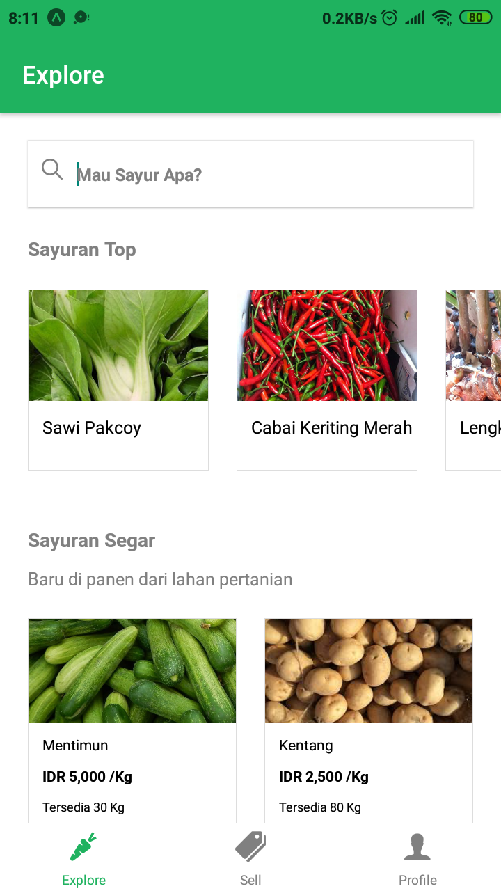
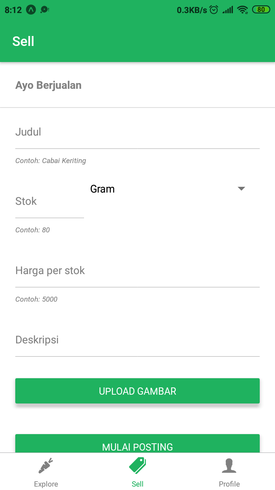

# test-expo
Test membuat aplikasi menggunakan Expo 
Test making application using Expo

<h4>Preparation</h4>
1. Download Expo application in Playstore  
2. On CMD in folder project "expo start"  
3. Open your Expo application and scan barcode on CMD or Browser

<h4>Screenshot Explore Screen</h4>

